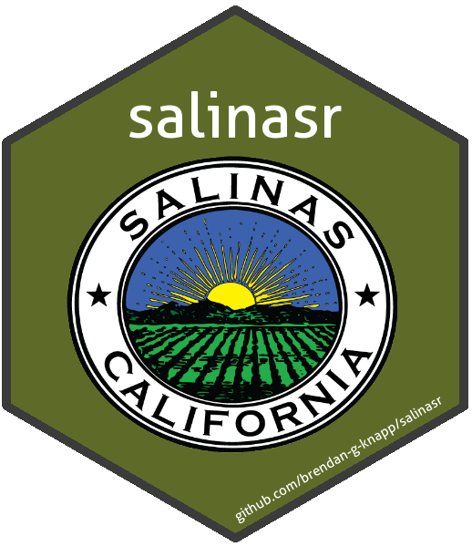

<!-- README.Rmd generates README.md. -->
salinasr 
=========================================================

<br>

An R package for programmatic access to the [Salinas Open Data Portal API](https://cityofsalinas.opendatasoft.com).

<br><br><br><br><br>

Installation
------------

``` r
# Install the (exceptionally early) development version from GitHub.
if(!"devtools" %in% installed.packages()[, "Package"]) {
  install.packages("devtools")
}
devtools::install_github("brendan-g-knapp/salinasr")
```

Usage
-----

``` r
library(salinasr)

catalog <- sal_fetch_catalog()

catalog
```

<pre class="r-output"><code>#&gt; <span style='color: #949494;'># A tibble: 100 x 5</span><span>
#&gt;    title       dataset_id   pub_date            description     link      
#&gt;    </span><span style='color: #949494;font-style: italic;'>&lt;chr&gt;</span><span>       </span><span style='color: #949494;font-style: italic;'>&lt;chr&gt;</span><span>        </span><span style='color: #949494;font-style: italic;'>&lt;dttm&gt;</span><span>              </span><span style='color: #949494;font-style: italic;'>&lt;chr&gt;</span><span>           </span><span style='color: #949494;font-style: italic;'>&lt;chr&gt;</span><span>     
#&gt; </span><span style='color: #BCBCBC;'> 1</span><span> Sendas par~ bikeways-es  2018-07-27 </span><span style='color: #949494;'>09:02:02</span><span> Esta capa indi~ http://ci~
#&gt; </span><span style='color: #BCBCBC;'> 2</span><span> Salinas Ou~ salinas-out~ 2018-07-18 </span><span style='color: #949494;'>21:24:12</span><span> This dataset c~ http://ci~
#&gt; </span><span style='color: #BCBCBC;'> 3</span><span> Eventos de~ salinas-out~ 2018-07-18 </span><span style='color: #949494;'>21:24:12</span><span> Este conjunto ~ http://ci~
#&gt; </span><span style='color: #BCBCBC;'> 4</span><span> Oficina de~ bls-smu0641~ 2018-07-05 </span><span style='color: #949494;'>21:38:36</span><span> Este conjunto ~ http://ci~
#&gt; </span><span style='color: #BCBCBC;'> 5</span><span> Bureau of ~ bls-smu0641~ 2018-07-05 </span><span style='color: #949494;'>21:38:36</span><span> This dataset f~ http://ci~
#&gt; </span><span style='color: #BCBCBC;'> 6</span><span> Oficina de~ bls-smu0600~ 2018-07-05 </span><span style='color: #949494;'>21:28:13</span><span> Este conjunto ~ http://ci~
#&gt; </span><span style='color: #BCBCBC;'> 7</span><span> Bureau of ~ bls-smu0600~ 2018-07-05 </span><span style='color: #949494;'>21:28:13</span><span> This dataset f~ http://ci~
#&gt; </span><span style='color: #BCBCBC;'> 8</span><span> BETA de hu~ building-fo~ 2018-07-03 </span><span style='color: #949494;'>18:47:00</span><span> Esta es una ve~ http://ci~
#&gt; </span><span style='color: #BCBCBC;'> 9</span><span> Building F~ building-fo~ 2018-07-03 </span><span style='color: #949494;'>18:47:00</span><span> This is a beta~ http://ci~
#&gt; </span><span style='color: #BCBCBC;'>10</span><span> Fire Distr~ firedistric~ 2018-07-03 </span><span style='color: #949494;'>00:04:17</span><span> The districts ~ http://ci~
#&gt; </span><span style='color: #949494;'># ... with 90 more rows</span><span>
</span></code></pre>
