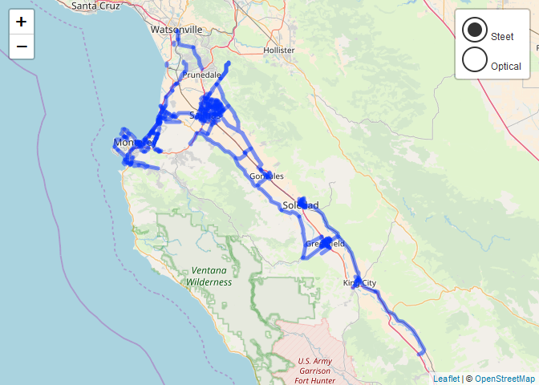

<!-- README.Rmd generates README.md. -->
salinasr 
======================================================================================

<br>

An R package for programmatic access to the [Salinas Open Data Portal API](https://cityofsalinas.opendatasoft.com).

<br><br><br><br>

Installation
------------

``` r
# install the (exceptionally early) development version from GitHub via {devtools}
if(!require(devtools)) {
  install.packages("devtools")
}

devtools::install_github("knapply/salinasr")
```

Usage
-----

``` r
library(salinasr)
library(leaflet)

bikeways_sf <- sal_get_metadata("bikeways") %>% 
  sal_get_dataset()
```

``` r
bikeways_sf %>%
  leaflet() %>%
  addProviderTiles(leaflet::providers$OpenStreetMap, group = "Street Map") %>%
  addProviderTiles(providers$Esri.WorldImagery, group = "Optical Imagery") %>%
  addPolylines(label = ~ name,
               popup = paste0(
                 "<b>Name:</b> ", bikeways_sf$name, "<br>",
                 "<b>Jurisdiction:</b> ", bikeways_sf$juris, "<br>",
                 "<b>Start:</b> ", bikeways_sf$start, "<br>",
                 "<b>End</b>: ", bikeways_sf$end, "<br>",
                 "<b>Miles:</b> ", round(bikeways_sf$miles, 2), "<br>",
                 "<b>Feet:</b> ", round(bikeways_sf$feet, 2)
                 )
               ) %>%
  addLayersControl(baseGroups = c("Street Map", "Optical Imagery"),
                   options = layersControlOptions(collapsed = FALSE))
```


