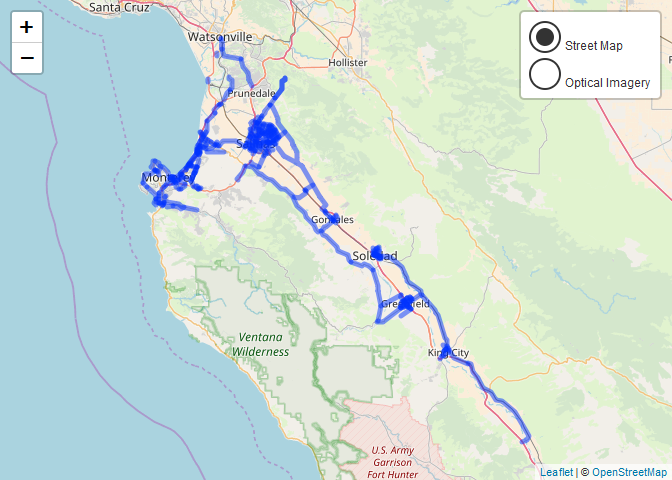

<!-- README.Rmd generates README.md. -->
salinasr 
======================================================================================

<br>

An R package for programmatic access to the [Salinas Open Data Portal API](https://cityofsalinas.opendatasoft.com).

<br><br><br><br>

Installation
------------

``` r
# Install the (exceptionally early) development version from GitHub via {devtools}
if(!require(devtools)) {
  install.packages("devtools")
}

devtools::install_github("knapply/salinasr")
```

Usage
-----

``` r
library(salinasr)

(bikeways_sf <- sal_get_metadata("bikeways") %>%
  sal_get_dataset()) %>% 
  dplyr::select(name, juris, miles)
```

<pre class="r-output"><code>#&gt; Simple feature collection with 302 features and 3 fields
#&gt; geometry type:  MULTILINESTRING
#&gt; dimension:      XY
#&gt; bbox:           xmin: -121.9639 ymin: 36.01251 xmax: -120.9042 ymax: 36.90522
#&gt; epsg (SRID):    4326
#&gt; proj4string:    +proj=longlat +datum=WGS84 +no_defs
#&gt; <span style='color: #949494;'># A tibble: 302 x 4</span><span>
#&gt;    name             juris   miles                                 geometry
#&gt;    </span><span style='color: #949494;font-style: italic;'>&lt;chr&gt;</span><span>            </span><span style='color: #949494;font-style: italic;'>&lt;chr&gt;</span><span>   </span><span style='color: #949494;font-style: italic;'>&lt;dbl&gt;</span><span>                   </span><span style='color: #949494;font-style: italic;'>&lt;MULTILINESTRING [°]&gt;</span><span>
#&gt; </span><span style='color: #BCBCBC;'> 1</span><span> California Ave   Marina 1.21   ((-121.7968 36.66623, -121.7967 36.6663~
#&gt; </span><span style='color: #BCBCBC;'> 2</span><span> Beach Rd         Marina 0.271  ((-121.7973 36.69362, -121.7975 36.6937~
#&gt; </span><span style='color: #BCBCBC;'> 3</span><span> Thomas Owens Way Monte~ 0.060</span><span style='text-decoration: underline;'>9</span><span> ((-121.8189 36.58016, -121.8187 36.5802~
#&gt; </span><span style='color: #BCBCBC;'> 4</span><span> Wilson Rd        Monte~ 0.160  ((-121.8083 36.57288, -121.8087 36.5730~
#&gt; </span><span style='color: #BCBCBC;'> 5</span><span> Valley Greens Dr County 1.98   ((-121.8819 36.53622, -121.8708 36.5339~
#&gt; </span><span style='color: #BCBCBC;'> 6</span><span> Herold Pkwy      Gonza~ 0.815  ((-121.4324 36.50594, -121.4311 36.5067~
#&gt; </span><span style='color: #BCBCBC;'> 7</span><span> Walnut Ave       Green~ 0.146  ((-121.2503 36.32578, -121.2511 36.3253~
#&gt; </span><span style='color: #BCBCBC;'> 8</span><span> Monterey Penins~ Caltr~ 2.59   ((-121.7883 36.7225, -121.7884 36.7222,~
#&gt; </span><span style='color: #BCBCBC;'> 9</span><span> Maryal           Salin~ 0.395  ((-121.6461 36.691, -121.6467 36.69187,~
#&gt; </span><span style='color: #BCBCBC;'>10</span><span> Creekbridge      Salin~ 1.07   ((-121.6216 36.7015, -121.6216 36.7015,~
#&gt; </span><span style='color: #949494;'># ... with 292 more rows</span><span>
</span></code></pre>
``` r
ggmap::get_map("Salinas, CA", zoom = 11) %>% 
  ggmap::ggmap() +
  ggplot2::geom_sf(data = bikeways_sf, color = "red", inherit.aes = FALSE)
```


