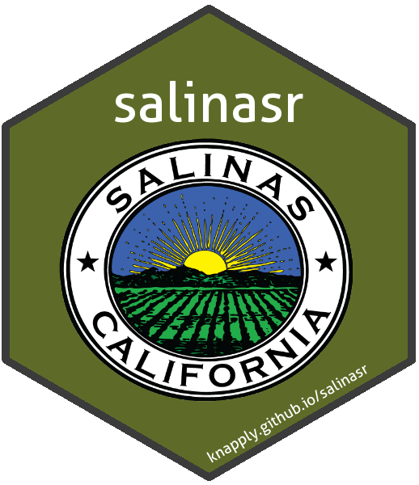

<!-- README.Rmd generates README.md. -->
salinasr 
======================================================================================

<br>

An R package for programmatic access to the [Salinas Open Data Portal API](https://cityofsalinas.opendatasoft.com).

<br><br><br><br><br>

Installation
------------

``` r
# Install the (exceptionally early) development version from GitHub.
if(!"devtools" %in% installed.packages()[, "Package"]) {
  install.packages("devtools")
}
devtools::install_github("brendan-g-knapp/salinasr")
```

Usage
-----

``` r
library(salinasr)

catalog <- sal_fetch_catalog()

catalog
```

<pre class="r-output"><code>#&gt; <span style='color: #949494;'># A tibble: 100 x 5</span><span>
#&gt;    title      dataset_id     pub_date            description     link     
#&gt;    </span><span style='color: #949494;font-style: italic;'>&lt;chr&gt;</span><span>      </span><span style='color: #949494;font-style: italic;'>&lt;chr&gt;</span><span>          </span><span style='color: #949494;font-style: italic;'>&lt;dttm&gt;</span><span>              </span><span style='color: #949494;font-style: italic;'>&lt;chr&gt;</span><span>           </span><span style='color: #949494;font-style: italic;'>&lt;chr&gt;</span><span>    
#&gt; </span><span style='color: #BCBCBC;'> 1</span><span> Salarios ~ public-employ~ </span><span style='color: #BB0000;'>NA</span><span>                  Los datos prov~ http://c~
#&gt; </span><span style='color: #BCBCBC;'> 2</span><span> Plan maes~ master-plan-r~ </span><span style='color: #BB0000;'>NA</span><span>                  Desglose de có~ http://c~
#&gt; </span><span style='color: #BCBCBC;'> 3</span><span> Límites d~ salinas-bound~ </span><span style='color: #BB0000;'>NA</span><span>                  Este dato indi~ http://c~
#&gt; </span><span style='color: #BCBCBC;'> 4</span><span> Detention~ waterways      </span><span style='color: #BB0000;'>NA</span><span>                  Detention basi~ http://c~
#&gt; </span><span style='color: #BCBCBC;'> 5</span><span> Master Pl~ master-plan-r~ </span><span style='color: #BB0000;'>NA</span><span>                  Age breakdown ~ http://c~
#&gt; </span><span style='color: #BCBCBC;'> 6</span><span> Área con ~ alisal-strate~ </span><span style='color: #BB0000;'>NA</span><span>                  Este mapa desc~ http://c~
#&gt; </span><span style='color: #BCBCBC;'> 7</span><span> Library P~ library-progr~ </span><span style='color: #BB0000;'>NA</span><span>                  Program Attend~ http://c~
#&gt; </span><span style='color: #BCBCBC;'> 8</span><span> Fire Dist~ firedistricts  </span><span style='color: #BB0000;'>NA</span><span>                  The districts ~ http://c~
#&gt; </span><span style='color: #BCBCBC;'> 9</span><span> Zonas de ~ runway-protec~ </span><span style='color: #BB0000;'>NA</span><span>                  Este dato mues~ http://c~
#&gt; </span><span style='color: #BCBCBC;'>10</span><span> Street Li~ street-lights  </span><span style='color: #BB0000;'>NA</span><span>                  This map repre~ http://c~
#&gt; </span><span style='color: #949494;'># ... with 90 more rows</span><span>
</span></code></pre>
